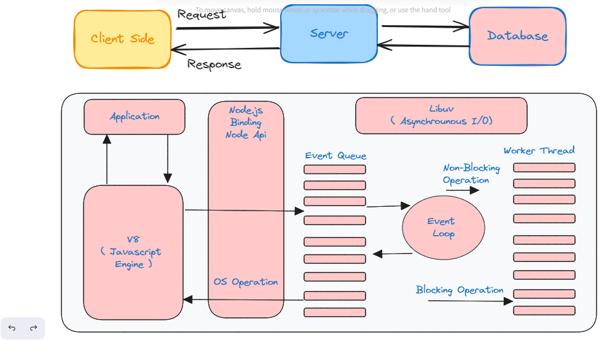

# Definition of Node js 

* Open Source
* Javascript Runtime Enviroment
* Event Driven
* Blocking Non-Blocking I/O model
* Internally code written by Javascript and C/C++
* Input Output (File System)

## Example in Real World

* Realtime Application ( Chat process )
* Single Page Application
* IOT ( Internet of Things ) apps
* Data Streaming Apps

# Architecture of Node js


The architecture components comprises two main concepts : an Asynchronous model that resembles the event based approach and non-blocking I/O operation.

Components are - 
* Request
* Node.js Server
* Event Queue
* Event Loop
* Worker Thread or Thread Pool
* External Resources

## Advantages of Node.js

* Node js is asynchrounous model and non-blocking I/O model operation that improves the scalabiltiy and performance of web application.

* Node js can handle multiple request easily without requiring multiple thread, consuming less memory and resources.

*  Node js is also flexible with multiple framework, which make the devlopment easier.

# NPM ( Node Package Manager )
* Default package manager of Node js
* Package management
* Command line interface
* Version Control
* Manage dependencies
* Publishing and sharing packages
* Scripts and automate

### npm init
used to initialize new or existing npm package
```
<!-- For manually package name -->

npm init

<!-- For auto package name -->

npm init -y
```

### Installing Package in node

```
npm install package_name

npm install package1, package2, package3

npm install package_name --save

npm install package_name --save-dev
```
### Uninstalling Package in node

```
npm uninstall package_name

npm uninstall package1, package2, package3

npm uninstall package_name --save

npm uninstall package_name --save-dev
```

# Package.json
* Serves as the centerpiece of node js
* Project's manifest file
* Divided in two category:
 1. identifying metadata property ( which include author's name, current version, project's name, license and project description )
2. functional metadata property ( which include scripts being used, project dependencies, starting point of the module, repository link )


# Nodejs Path Module
* allows you to interact with file path easily
* property and methods used to manipulate path in the file system

### Handy Path Method
```
path.basename(path, [ext])
path.dirname(path)
path.extname(path)
path.formath(pathObj)
path.isAbsolute(path)
path.join(...path)
path.parse(path)
path.relative(from, to)
path.resolve(...path)
```

# File System
* Node js includes built in module called FS ( File System )
* allows users to manage files which includes creating, reading, deleting, and performing other operations too.

* ``` var fs = require( 'fs' ) ```

### Notes :
Synchronous : involves blocking operations that wait for each operations to complete to executing for the next one

Asynchronous : involves non-blocking operation that execute all operation all operation at once w/o waiting for next operation to complete.

# OS Module
* used to retrive details about the operating system of a computer
* methods like retreiving the hostname, storage availability in bytes

### Method of OS module
```
os.arch();
os.freemem();
os.totalmem();
os.networkInterfaces();
os.tmpdir();
os.endianness();
os.hostname();
os.type();
os.platform();
os.release();
```
# HTTP Module 
* HTTP stands for Hyper Text Transfer Protocol
* core modules of Node js
* used for transmitting data over the internet
* defines how client and server will communicate with each other and how request and response should be transmitted and formatted

### Feature of HTTP method 
* Create an HTTP server using ```http.createServer()```
* Listen incoming request using ```server.listen()```
* Set headers on the response ```res.setHeaders()```
* Write data on the response ```res.write()```
* End the response ```res.end()```
* Send a http request to server ```http.request()```

# URLs ( Uniform Resource Location )
* is a reference to a web resource that specifies its location on a computer network

---
# Framework

- is a software tool that provides devloper with a set of pre written code, components, and libraries
- often include a set of guideline and best practices that help devloper to write code efficiently

### Different types of Node js framework
---
Help software devloper to devlop efficiently and with ease are as follows : 
* **express.js** ( Fast and unopinionated, minimalist web framework for node js, it main features in two concepts robust routing and middleware function )
* **Koa.js** ( team behind express, makes lightweight to middleware function and callback )
* **Nest.js** ( reliable and scable server side application )
* **Hapi.js** ( reliable, scalable and full out of the box functionality )
* **Fastify.js** ( fast and low overhead web framework )
* **Sails.js** ( MVC framework )

---
# Express
* installing ``` npm install express ```
* importing ```const express = require('express)```
* create an instance of express ```create app = express()```
* create a route ```app.get()```
* listen a route ```app.listen()```

### Why do we use Express.js
* lightweight and unopinionated
* fast and efficient for building scalable web applications in traffic

* easy to learn due its simplicity and intuitive API
* modular extensible
* large and active community
* routing and middleware support

# PORT
* logically construct that is used to identify a specific process running on a computer or other network devices
* associated with a host address such as IP address
* specific port number are reserved

### Different types of PORT number
There are 65,535 available port number, which can be classified into three category - 
* Well-known Port
* Registered Port
* Dynamic or Private Port

Note : They are all assigned by Indian Assigned Number Authority

---
# REST
* REST stand for Representaion State Transfer
* architectual used for building distributed system
followed mainly principles are - 
1. Client-server architectual
2. Stateless communication
3. Resource based interaction
4. Uniform interfaces
5. Cacheable

### REST API
* interface that two computer system use to exchange information over the internet
* API stand for Application Programming Inteface
* API is a set of rules that devlopers use to build software that communicate with another system

Note -
* **Stateful Rest Api** : The server store information about client
* **Stateless Rest Api** : The server does not store information about client

### How REST API work 
* work by using HTTP request methods such as 'GET', 'POST', 'PUT', 'DELETE' and some more